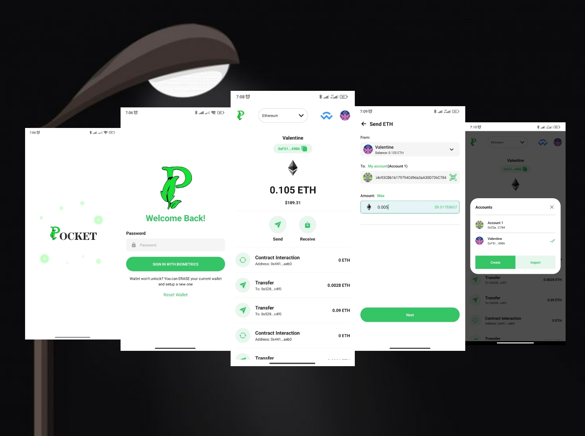

# Pocket

<p align="center">

</p>

[Pocket](https://play.google.com/store/apps/details?id=com.pocket.scaffoldwallet&pli=1) is a safe and secure crypto wallet to manage funds, interact with Dapps, sign transactions and more on multiple chains such as Ethereum, Optimism, Arbitrum, Sepolia, e.t.c

## Setting Up React Native

Visit the react native docs to [setup react native](https://reactnative.dev/docs/environment-setup) for Android and IOS.

## Install Dependencies

`Run from project root folder`

#### Using npm:

```shell
npm install
```

#### Using yarn:

```shell
yarn
```

`Install pods for ios:`

```shell
npx pod-install
```

`Resolve build issues`
1. Go to 'node_modules/react-native-webview/android/gradle.properties'
2. Change 'ReactNativeWebView_kotlinVersion' property value to 1.7.20

## Run Android Build

#### Using npm:

```shell
npx react-native run-android
```

#### Using yarn:

```shell
yarn android
```

## Run IOS Build

#### Using npm:

```shell
npx react-native run-ios
```

#### Using yarn:

```shell
yarn ios
```

## Generate Android Release Build

Visit the react native docs for a proper guide on how to [generate the android release build](https://reactnative.dev/docs/signed-apk-android)

### [Video guide](https://www.youtube.com/watch?v=5tgcogEoIiQ&t=543s)

## Generate IOS Release Build

Visit the react native docs for a proper guide on how to [generate the ios release build](https://reactnative.dev/docs/publishing-to-app-store)

### [Video guide](https://www.youtube.com/watch?v=r-Z--YDrmjI)